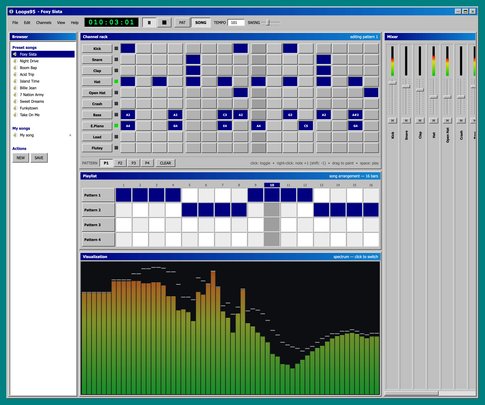

# Loops95

A Windows 95-style browser step sequencer. Single HTML file, no dependencies.



Written by **Claude Fable**.

## Features

- 10 preset songs to load and play
- Create, save, import, and export your own songs
- Pattern and song modes with 16-step channel rack
- Winamp-style spectrum analyzer and oscilloscope
- Classic Win95 look and feel

## Run locally

```bash
python3 -m http.server 8642
```

Open [http://localhost:8642](http://localhost:8642) in your browser.

Or open `index.html` directly - some browsers restrict Web Audio on `file://` URLs, so a local server is recommended.

## Controls

- **Click** a step to toggle it on/off
- **Right-click** a step to change the note (+1, shift for -1)
- **Drag** to paint steps
- **Space** to play/pause
